<h1>
	
	Hey there, nice to see you.
</h1>

    <a href="https://x.com/paper_sus" target="_blank">
    <a href="mailto:zwr.falling@gmail.com" target="_blank">
    
    
 

Hi, I'm [flowerfalling](https://github.com/flowerfalling/flowerfalling), a Student 🚀 from China.

<h3>
	
	About Me...
</h2>

- ⛴️ I love  learning new technologies.
- 👨🏻‍💻 I love to participate in programming projects.
- 📫 Reach me at: [zwr.falling@gmail.com](mailto:zwr.falling@gmail.com)

## 📊 Github Stats

<table><tr><td valign="top" width="50%">

 

</td><td valign="top" width="50%">

</td></tr></table>

<table><tr><td valign="top" width="50%">

</td><td valign="top" width="50%">

</td></tr></table>

<h2>
	
	Development Stats
</h2>

<h2>
	
	Project Time
</h2>

---
